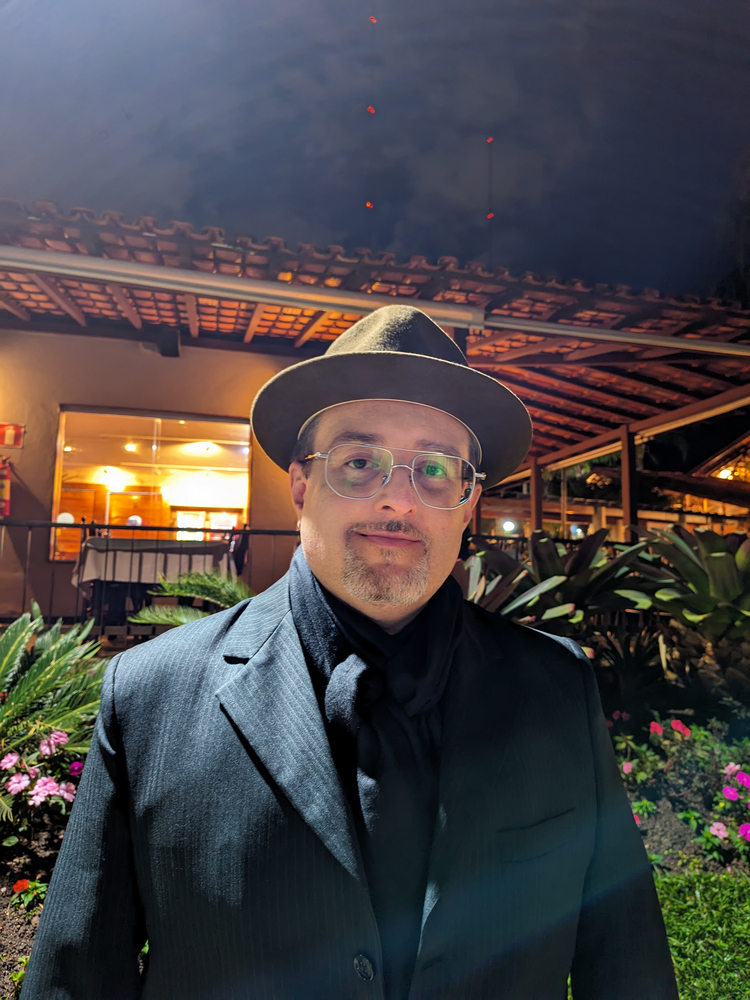

<!DOCTYPE html>
<html lang="pt-BR">
<head>
    <meta charset="UTF-8">
    <meta name="viewport" content="width=device-width, initial-scale=1.0">
    
    
    
    
    <title>WAGNER ABRAHÃO | Arquiteto do Invisível</title>
    <meta name="description" content="Wagner Abrahão - Literatura filosófica, espiritualidade e arquitetura do invisível.">
    
    
    <link href="https://fonts.googleapis.com/css2?family=Cinzel:wght@400;700&family=Cormorant+Garamond:ital,wght@0,300;0,400;0,700;1,400&family=Raleway:wght@200;400&display=swap" rel="stylesheet">
    <link rel="stylesheet" href="https://cdnjs.cloudflare.com/ajax/libs/font-awesome/6.4.0/css/all.min.css">
    
    
</head>
<body>

    <audio id="musica-portal" loop><source src="musica.mp3" type="audio/mpeg"></audio>

    

        

            <h2 style="font-family:'Cinzel'; color:var(--ouro); letter-spacing:6px; margin-bottom:12px;">WAGNER ABRAHÃO</h2>
            
ARQUITETURA DO INVISÍVEL

            <button class="btn-adentrar" onclick="despertarPortal()">ADENTRAR</button>
        

    

    

    

    <nav id="menu-lateral">
        
<i class="fas fa-home"></i>

        
<i class="fas fa-feather"></i>

        
<i class="fas fa-quote-right"></i>

        
<i class="fas fa-book"></i>

        
<i class="fas fa-envelope"></i>

    </nav>

    <main id="area-texto">
        
        <section id="home" class="secao ativa">
            

                
            

            <h1 class="h1-identidade">WAGNER ABRAHÃO</h1>
            
FILOSOFIA • ESPIRITUALIDADE • LITERATURA

            
            

                <h2 class="h2-secao">MISSÃO</h2>
                
Revelar as estruturas invisíveis que sustentam a nossa realidade cotidiana. Minha obra busca oferecer sentido e acalento através da palavra, conectando o visível ao transcendente de forma universal e acolhedora.

            

        </section>

        <section id="poesia" class="secao">
            <h2 class="h2-secao">POESIA</h2>
            

                <h3 class="h3-card">ANESTESIA DIVINA</h3>
                
"Dante não sabia que estava dormindo.
                Durante anos, viveu em estado de espera silenciosa.
                Sua existência era um ponto central perpétuo,
                até que a perda se tornou revelação."

            

            

                <h3 class="h3-card">A MEMÓRIA DA LUZ</h3>
                
"Antes da forma, havia apenas luz.
                Em cada átomo, uma centelha lembra sua origem divina.
                Esquecer é humano; lembrar é o caminho de volta."

            

        </section>

        <section id="aforismos" class="secao">
            <h2 class="h2-secao">AFORISMOS</h2>
            

                <h3 class="h3-card">O SILÊNCIO</h3>
                
"No vácuo entre as palavras, a sabedoria se revela. O silêncio não é ausência, é a plenitude do que ainda não foi dito".

            

            

                <h3 class="h3-card">A BELEZA</h3>
                
"A beleza verdadeira não está na perfeição da forma, mas na autenticidade da essência. É o invisível que torna o visível significativo".

            

        </section>

        <section id="manuscritos" class="secao">
            <h2 class="h2-secao">MANUSCRITOS</h2>
            

                <h3 class="h3-card">A ARQUITETURA DO INVISÍVEL</h3>
                
Um tratado sobre as estruturas ocultas que sustentam a nossa existência. Uma análise profunda sobre as fundações espirituais e os princípios da construção consciente.

            

            

                <h3 class="h3-card">A ANESTESIA DIVINA (OBRA)</h3>
                
Uma exploração sobre o despertar da consciência através da rendição absoluta. A obra investiga os véus da percepção que separam o cotidiano da vigília espiritual.

            

        </section>

        <section id="contato" class="secao">
            <h2 class="h2-secao">CONEXÃO</h2>
            

                
Para partilhas, parcerias e diálogos:

                
wagner.abrahao.31@gmail.com

                
                

                    <a href="https://instagram.com/wagnerabrahao_" target="_blank" style="color: var(--ouro); font-size: 2.2rem;"><i class="fab fa-instagram"></i></a>
                    <a href="https://tiktok.com/@wagner.abrahao" target="_blank" style="color: var(--ouro); font-size: 2.2rem;"><i class="fab fa-tiktok"></i></a>
                

            

        </section>
    </main>

    
</body>
</html>
